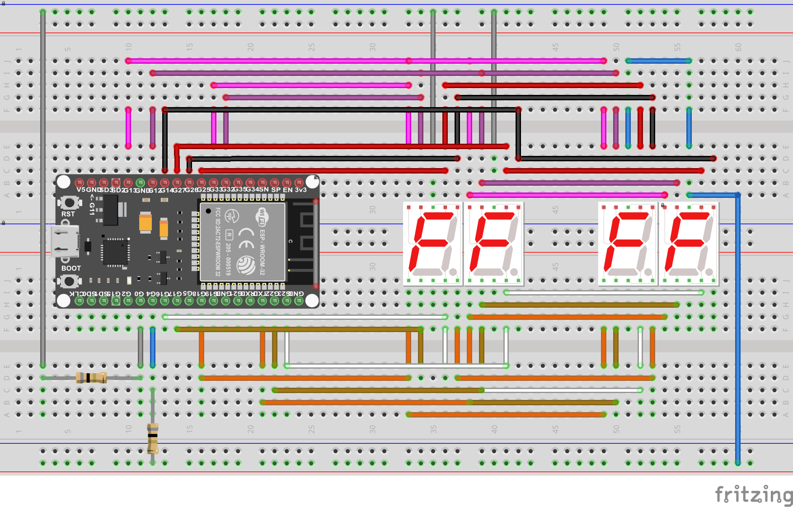

# esp32-micropython
 Micropython programs running on ESP32 microcontroller

### COMPONENTS
* 1 x 38-pins ESP32 microcontroller (flashed with micropython)
* 2 x 7-segment LED display (common cathode)
* 2 x 7-segment LED display (common anode)

### PROGRAMS
* digit.py -  script to displays the current digit in a 7-segment LED (common-cathode) display
* blink_random_digit.py - script to generate random number and display the number in a 7-segment LED (common-cathode) display
* two_digits.py - script to display two digits in 2 7-segment LED (common-cathode) display
* wireless_ssid_count.py - scipt to scan for available wireless SSIDs and display the count in 2 7-segment LED (common-cathode) display
* clock.py - script to display current in 4 7-segment display without any additional circuitary.
            Same GPIO pins are used to display two numbers in seperate LED display.
             This is achieved by using common-anode and common-cathode LED display and cotrolling both programmatically.  
            One caveat is that the display flashes in pre-defined interval. This is because we are using same set of GPIO pins for 2 display. To show time on both the display, we are clearing the display and displaying the numbers again and again. This results in the flashing effect.

### CLOCK DEMO

### CLOCK CIRCUIT
